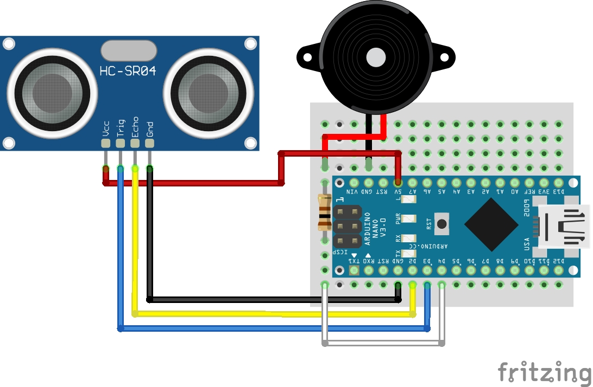

# touchless-doorbell

## Project Description

In light of the new contactless world order, I wanted to build a touchless doorbell based on the Arduino Nano. Because I didn't have a plug nearby, I built in some power saving measures so that the doorbell can run on a battery.

## Components
* Arduino Nano
* HC-SR04 ultrasonic sensor
* Buzzer
* 100 ohm resistor

## Schematic

## Dependencies
* [Adafruit SleepyDog](https://github.com/adafruit/Adafruit_SleepyDog) library for putting the Arduino Nano into low power mode
* [NewPing](https://bitbucket.org/teckel12/arduino-new-ping/wiki/Home) library for measuring distance with ultrasonic sensor
